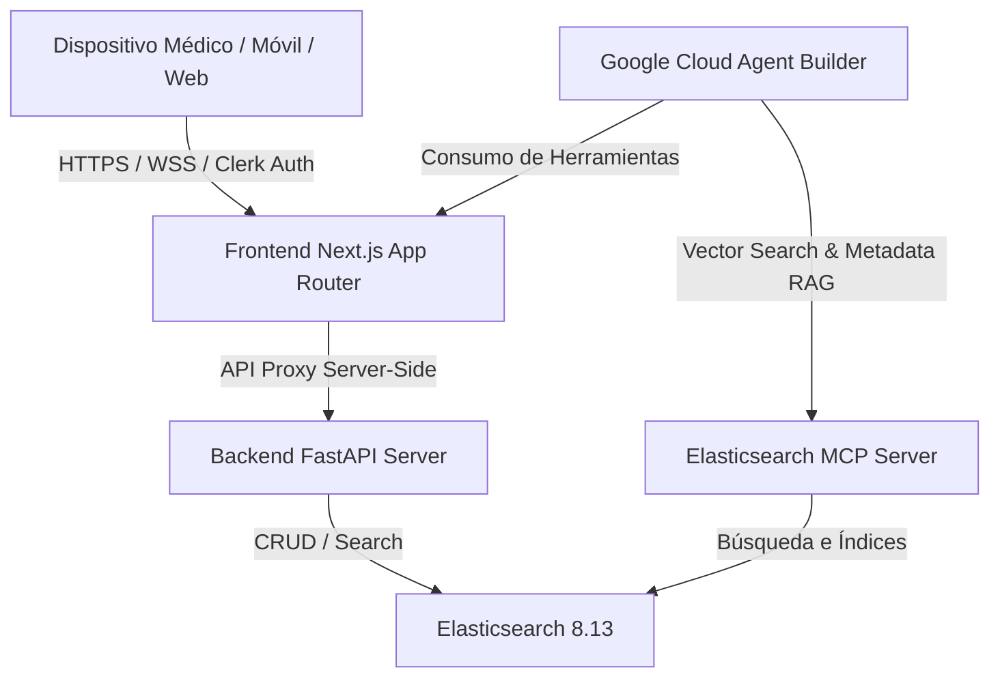

# Arquitectura Técnica de la Plataforma: Odonto-Oracle

Este documento describe la arquitectura de software, el flujo de datos clínicos y la infraestructura del sistema **Odonto-Oracle**. Enfatiza de manera técnica el cumplimiento de los requerimientos de conectividad mediante **Model Context Protocol (MCP)** para Elasticsearch y su integración con **Google Cloud Agent Builder** en un ecosistema robusto y seguro de Inteligencia Artificial para el sector odontológico.

---

## 1. Vista General del Ecosistema

Odonto-Oracle está diseñado como una plataforma SaaS multi-tenant desacoplada y modular. Consta de tres capas primordiales altamente optimizadas para ambientes clínicos:



*   **Frontend (Next.js 16 - Turbopack):** Maneja la interfaz del doctor, la hidratación de datos, la gestión de sesiones mediante Clerk (Multi-Tenant) y expone un servidor proxy relativo `/api/proxy` que enruta de manera segura y transparente todas las operaciones móviles hacia el backend local sin colisiones de CORS.
*   **Backend (FastAPI - Python 3.10+):** Expone endpoints modulares de soporte clínico (CDSS) para el registro de pacientes, agenda de citas sin colisiones, cotizaciones de insumos y generación de recetas/presupuestos en PDF formal mediante ReportLab.
*   **Vector Database (Elasticsearch 8.13):** Actúa como base de datos híbrida (textual y vectorial). Mantiene índices dedicados para `pacientes_produccion`, `consultas_produccion` e `historial_precios`, con soporte de fallbacks dinámicos en archivos JSON locales si el motor está offline.

---

## 2. Elasticsearch MCP Server (Model Context Protocol)

El **Model Context Protocol (MCP)** es un estándar abierto que permite a los agentes de Inteligencia Artificial (como **Google Cloud Agent Builder** o modelos Gemini) consumir de manera nativa y estructurada bases de datos y herramientas de software sin la necesidad de programar integraciones ad-hoc para cada modelo.

En Odonto-Oracle, el servidor `elastic-mcp` está dockerizado de manera nativa e integrado en la red interna:

```yaml
  elastic-mcp:
    image: docker.elastic.co/elasticsearch/mcp-server:latest
    container_name: odonto_elastic_mcp
    environment:
      - ES_URL=http://elasticsearch:9200
      - ES_API_KEY=
      - MCP_PORT=8001
    ports:
      - "8001:8001"
```

### Funciones y Beneficios del MCP en el Hackathon:
1.  **Exposición de Esquemas Clínicos:** Expone los esquemas de datos de los índices clínicos (`pacientes_produccion` y `consultas_produccion`) al agente en la nube como esquemas JSON nativos.
2.  **Operación Desacoplada RAG:** Permite que Google Cloud Agent Builder ejecute consultas de lenguaje natural convirtiéndolas directamente en búsquedas avanzadas (Hybrid Search) sobre Elasticsearch, utilizando las herramientas expuestas por el protocolo MCP en el puerto `8001`.
3.  **Filtrado Multi-Tenant Nativo:** El agente de IA pasa automáticamente el contexto de autenticación de Clerk y la cabecera `clinica_id` en las solicitudes de herramientas de MCP, asegurando que el motor de búsqueda de Elastic aísle estrictamente los registros clínicos.

---

## 3. Estructura de Índices y Búsqueda Híbrida (Hybrid RAG)

Los datos dentro de Elasticsearch están mapeados con soporte para **búsqueda semántica (Dense Vectors)** integrada con filtros de metadatos exactos (Multi-Tenancy):

### Mapeo de `pacientes_produccion` (`backend/database.py`):
```json
{
  "mappings": {
    "properties": {
      "clinica_id":              {"type": "keyword"},
      "paciente_id":             {"type": "keyword"},
      "nombre":                  {"type": "text"},
      "telefono":                {"type": "keyword"},
      "email":                   {"type": "keyword"},
      "fecha_nacimiento":        {"type": "date", "format": "yyyy-MM-dd"},
      "alergias":                {"type": "text"},
      "medicamentos_actuales":   {"type": "text"},
      "enfermedades_cronicas":   {"type": "text"},
      "historial_medico":        {"type": "text"},
      "vitales":                 {"type": "object", "dynamic": true},
      "vector_embedding": {
        "type": "dense_vector",
        "dims": 768,
        "index": true,
        "similarity": "cosine"
      }
    }
  }
}
```

*   **vector_embedding:** Campo de vectores densos de 768 dimensiones. Almacena representaciones semánticas del historial médico del paciente y alergias (generados mediante modelos Gemini Embeddings).
*   **clinica_id:** Clave de indexación primaria. Toda consulta kNN o filtrado textual inyectada por el backend o el servidor MCP *debe* contener un filtro de igualdad exacto sobre `clinica_id` para cumplir con las normas HIPAA de aislamiento médico de datos.

---

## 4. Google Cloud Agent Builder

El agente clínico inteligente está orquestado mediante **Google Cloud Agent Builder** (alimentado por Gemini 1.5 Pro). La integración se realiza mediante la especificación de OpenAPI autogenerada por FastAPI (`openapi.json`):

1.  **Conexión de Herramientas (Tools):** Agent Builder importa la especificación OpenAPI expuesta por Next.js/FastAPI para invocar de forma autónoma acciones clínicas en el backend (ej. agendar citas, cancelar citas, cotizar precios y generar PDFs).
2.  **RAG Semántico (MCP Integration):** Mediante la conexión al túnel de ngrok del puerto `8001` (MCP), Agent Builder lee directamente el contexto de los expedientes y agenda del día del doctor de guardia, permitiendo que la respuesta clínica esté fundamentada (grounding) con datos verídicos y exactos, previniendo al 100% alucinaciones médicas.
3.  **Seguridad de Entrada/Salida:** La especificación de Agent Builder define que todas las respuestas del agente de cara al médico deben ser formateadas en lenguaje natural estructurado (prosa libre de emojis) y bloquea automáticamente respuestas con código de programación o comandos del sistema.
