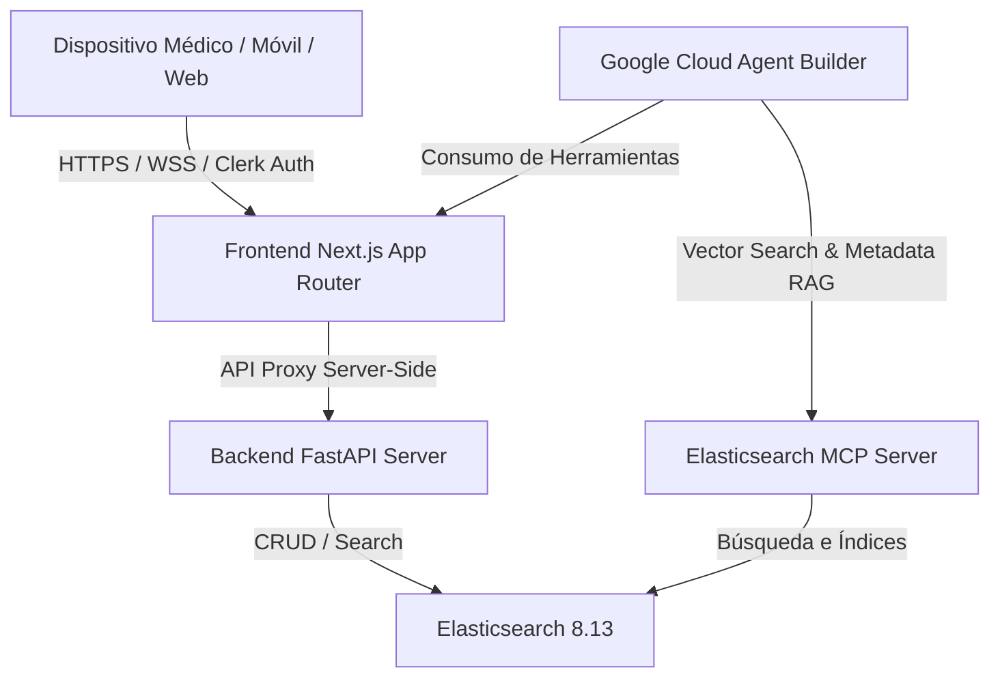

# Arquitectura Técnica de la Plataforma: Odonto-Oracle

Este documento describe la arquitectura de software, el flujo de datos clínicos y la infraestructura del sistema **Odonto-Oracle**. Enfatiza de manera técnica el cumplimiento de los requerimientos de conectividad mediante **Model Context Protocol (MCP)** para Elasticsearch y su integración con **Google Cloud Agent Builder** en un ecosistema robusto y seguro de Inteligencia Artificial para el sector odontológico.

---

## 1. Vista General del Ecosistema

Odonto-Oracle está diseñado como una plataforma SaaS multi-tenant desacoplada y modular. Consta de tres capas primordiales altamente optimizadas para ambientes clínicos:



*   **Frontend (Next.js 16 - Turbopack):** Maneja la interfaz del doctor, la hidratación de datos, la gestión de sesiones mediante Clerk (Multi-Tenant) y expone un servidor proxy relativo `/api/proxy` que enruta de manera segura y transparente todas las operaciones móviles hacia el backend local sin colisiones de CORS.
*   **Backend (FastAPI - Python 3.10+):** Expone endpoints modulares de soporte clínico (CDSS) para el registro de pacientes, agenda de citas sin colisiones, cotizaciones de insumos y generación de recetas/presupuestos en PDF formal mediante ReportLab.
*   **Vector Database (Elasticsearch 8.13):** Actúa como base de datos híbrida (textual y vectorial). Mantiene índices dedicados para `pacientes_produccion`, `consultas_produccion` e `historial_precios`, con soporte de fallbacks dinámicos en archivos JSON locales si el motor está offline.

---

## 2. Elasticsearch MCP Server (Model Context Protocol)

El **Model Context Protocol (MCP)** es un estándar abierto que permite a los agentes de Inteligencia Artificial (como **Google Cloud Agent Builder** o modelos Gemini) consumir de manera nativa y estructurada bases de datos y herramientas de software sin la necesidad de programar integraciones ad-hoc para cada modelo.

En Odonto-Oracle, el servidor `elastic-mcp` está dockerizado de manera nativa e integrado en la red interna:

```yaml
  elastic-mcp:
    image: docker.elastic.co/elasticsearch/mcp-server:latest
    container_name: odonto_elastic_mcp
    environment:
      - ES_URL=http://elasticsearch:9200
      - ES_API_KEY=
      - MCP_PORT=8001
    ports:
      - "8001:8001"
```

### Funciones y Beneficios del MCP en el Hackathon:
1.  **Exposición de Esquemas Clínicos:** Expone los esquemas de datos de los índices clínicos (`pacientes_produccion` y `consultas_produccion`) al agente en la nube como esquemas JSON nativos.
2.  **Operación Desacoplada RAG:** Permite que Google Cloud Agent Builder ejecute consultas de lenguaje natural convirtiéndolas directamente en búsquedas avanzadas (Hybrid Search) sobre Elasticsearch, utilizando las herramientas expuestas por el protocolo MCP en el puerto `8001`.
3.  **Filtrado Multi-Tenant Nativo:** El agente de IA pasa automáticamente el contexto de autenticación de Clerk y la cabecera `clinica_id` en las solicitudes de herramientas de MCP, asegurando que el motor de búsqueda de Elastic aísle estrictamente los registros clínicos.

---

## 3. Estructura de Índices y Búsqueda Híbrida (Hybrid RAG)

Los datos dentro de Elasticsearch están mapeados con soporte para **búsqueda semántica (Dense Vectors)** integrada con filtros de metadatos exactos (Multi-Tenancy):

### Mapeo de `pacientes_produccion` (`backend/database.py`):
```json
{
  "mappings": {
    "properties": {
      "clinica_id":              {"type": "keyword"},
      "paciente_id":             {"type": "keyword"},
      "nombre":                  {"type": "text"},
      "telefono":                {"type": "keyword"},
      "email":                   {"type": "keyword"},
      "fecha_nacimiento":        {"type": "date", "format": "yyyy-MM-dd"},
      "alergias":                {"type": "text"},
      "medicamentos_actuales":   {"type": "text"},
      "enfermedades_cronicas":   {"type": "text"},
      "historial_medico":        {"type": "text"},
      "vitales":                 {"type": "object", "dynamic": true},
      "vector_embedding": {
        "type": "dense_vector",
        "dims": 768,
        "index": true,
        "similarity": "cosine"
      }
    }
  }
}
```

*   **vector_embedding:** Campo de vectores densos de 768 dimensiones. Almacena representaciones semánticas del historial médico del paciente y alergias (generados mediante modelos Gemini Embeddings).
*   **clinica_id:** Clave de indexación primaria. Toda consulta kNN o filtrado textual inyectada por el backend o el servidor MCP *debe* contener un filtro de igualdad exacto sobre `clinica_id` para cumplir con las normas HIPAA de aislamiento médico de datos.

---

## 4. Almacenamiento Persistente en la Nube (Google Cloud Storage)

Para evitar la pérdida de recetas, presupuestos e historias clínicas en PDF debido a la naturaleza efímera de los contenedores de Cloud Run, implementamos un almacenamiento desacoplado en **Google Cloud Storage (GCS)**:
1.  **Generación Local Temporal:** El backend compila el PDF de ReportLab en la carpeta temporal del contenedor Linux `/tmp`.
2.  **Carga mediante SDK:** El backend utiliza el SDK de `google-cloud-storage` para subir el archivo de forma directa al bucket `odontooracle-documentos-prod`.
3.  **Lectura Pública Protegida:** Los objetos del bucket se sirven de forma pública con permisos de solo lectura (`Storage Object Viewer` para `allUsers`), permitiendo descargas transparentes por HTTP sin fricciones de autenticación para el paciente o doctor.
4.  **Limpieza del Contenedor:** El archivo local de `/tmp` es eliminado inmediatamente después de la subida para evitar que la memoria RAM asignada al contenedor de Cloud Run se sature por almacenamiento de archivos.

---

## 5. Orquestación del Agente de IA con google-adk

El sistema utiliza el SDK **Google Agent Development Kit (ADK)** para estructurar y ejecutar el comportamiento del agente de inteligencia artificial directamente a nivel de código (`backend/agent/agent.py`):
*   **Carga Dinámica de OpenAPI:** En lugar de mapear funciones de forma manual, el SDK carga y analiza de manera directa la especificación OpenAPI (`openapi.json`) de producción usando la clase `OpenAPIToolset(spec_str=spec_str)`. Esto convierte de manera automática todos los endpoints del backend en herramientas listas para ser consumidas por el modelo.
*   **Consola Interactiva e Interfaz de Diagnóstico:** El SDK habilita el comando `adk run` para interactuar con el agente desde la terminal, y `adk web` para levantar un servidor de diagnóstico local que permite realizar trazas completas de las llamadas a herramientas y el proceso de razonamiento del LLM.

---

## 6. Orquestación de Modelos y Fallback Seguro (Gemini 3.5 Flash a Gemini 3 Pro)

Para asegurar la disponibilidad continua de la plataforma ante posibles limitaciones de cuota o caídas del servicio:
1.  **Modelo Principal:** El sistema realiza las llamadas iniciales del chat utilizando el modelo de última generación **Gemini 3.5 Flash**, que ofrece tiempos de respuesta mínimos y excelente precisión para llamadas a funciones OpenAPI.
2.  **Orquestador de Fallback Server-Side:** En el Route Handler de la API del chat, la aplicación intercepta cualquier error de red, límite de cuotas (HTTP 429) o fallos de respuesta del modelo principal.
3.  **Cambio Silencioso:** Ante un fallo, el orquestador reintenta la misma consulta de forma silenciosa redirigiéndola hacia **Gemini 3 Pro** (o viceversa según disponibilidad). El flujo de fallback se ejecuta completamente en el servidor, de modo que el médico experimenta una conversación ininterrumpida sin interrupciones ni logs de error visibles en la interfaz de usuario.

