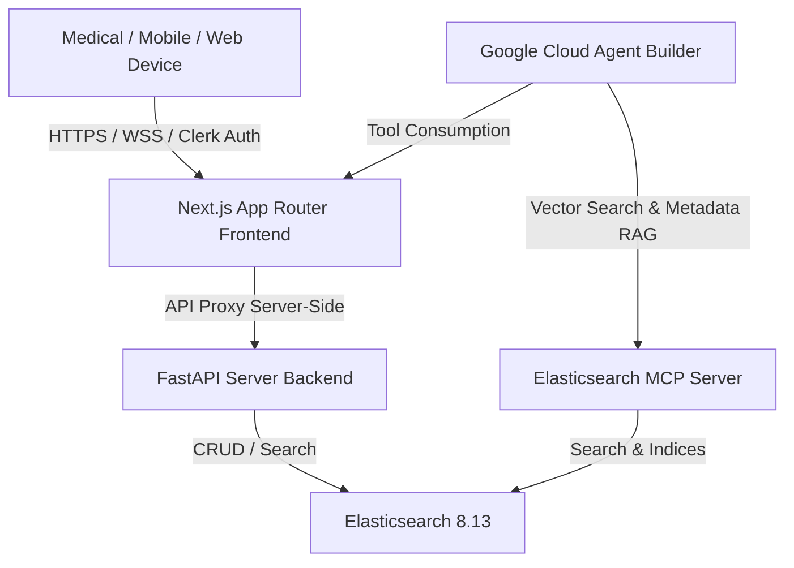

# Technical Architecture of the Platform: Odonto-Oracle

This document describes the software architecture, clinical data flow, and system infrastructure of **Odonto-Oracle**. It technically emphasizes the fulfillment of connectivity requirements through the **Model Context Protocol (MCP)** for Elasticsearch and its integration with **Google Cloud Agent Builder** in a robust and secure Artificial Intelligence ecosystem for the dental sector.

---

## 1. Ecosystem Overview

Odonto-Oracle is designed as a decoupled, modular, and high-availability multi-tenant SaaS platform. It consists of three primary layers highly optimized for clinical environments:



*   **Frontend (Next.js 16 - Turbopack):** Manages the doctor's interface, data hydration, session management using Clerk (Multi-Tenant), and exposes a relative server-side proxy `/api/proxy` that securely and transparently routes all mobile operations to the local backend without CORS collisions.
*   **Backend (FastAPI - Python 3.10+):** Exposes modular clinical decision support endpoints (CDSS) for patient registration, collision-free appointment scheduling, supply quotes, and dental estimate/prescription generation in formal PDF format using ReportLab.
*   **Vector Database (Elasticsearch 8.13):** Acts as a hybrid database (textual and vectorial). Maintains dedicated indices for `pacientes_produccion`, `consultas_produccion`, and `historial_precios`, with support for dynamic fallbacks in local JSON files if the engine is offline.

---

## 2. Elasticsearch MCP Server (Model Context Protocol)

The **Model Context Protocol (MCP)** is an open standard that enables Artificial Intelligence agents (such as **Google Cloud Agent Builder** or Gemini models) to natively and structurally consume databases and software tools without the need to program ad-hoc integrations for each model.

In Odonto-Oracle, the `elastic-mcp` server is natively dockerized and integrated into the internal network:

```yaml
  elastic-mcp:
    image: docker.elastic.co/elasticsearch/mcp-server:latest
    container_name: odonto_elastic_mcp
    environment:
      - ES_URL=http://elasticsearch:9200
      - ES_API_KEY=
      - MCP_PORT=8001
    ports:
      - "8001:8001"
```

### MCP Functions and Benefits in the Hackathon:
1.  **Clinical Schema Exposure:** Exposes the data schemas of clinical indices (`pacientes_produccion` and `consultas_produccion`) to the cloud agent as native JSON schemas.
2.  **Decoupled RAG Operation:** Allows Google Cloud Agent Builder to execute natural language queries by converting them directly into advanced searches (Hybrid Search) on Elasticsearch, using the tools exposed by the MCP protocol on port `8001`.
3.  **Native Multi-Tenant Filtering:** The AI agent automatically passes the Clerk authentication context and the `clinica_id` header in MCP tool requests, ensuring that the Elastic search engine strictly isolates clinical records.

---

## 3. Index Structure and Hybrid Search (Hybrid RAG)

Data within Elasticsearch is mapped with support for **semantic search (Dense Vectors)** integrated with exact metadata filters (Multi-Tenancy):

### Mapping of `pacientes_produccion` (`backend/setup_elastic.py`):
```json
{
  "mappings": {
    "properties": {
      "clinica_id":              {"type": "keyword"},
      "paciente_id":             {"type": "keyword"},
      "nombre":                  {"type": "text"},
      "telefono":                {"type": "keyword"},
      "email":                   {"type": "keyword"},
      "fecha_nacimiento":        {"type": "date", "format": "yyyy-MM-dd"},
      "alergias":                {"type": "text"},
      "medicamentos_actuales":   {"type": "text"},
      "enfermedades_cronicas":   {"type": "text"},
      "historial_medico":        {"type": "text"},
      "vitales":                 {"type": "object", "dynamic": true},
      "vector_embedding": {
        "type": "dense_vector",
        "dims": 768,
        "index": true,
        "similarity": "cosine"
      }
    }
  }
}
```

*   **vector_embedding:** 768-dimensional dense vector field. Stores semantic representations of the patient's medical history and allergies (generated using Gemini Embeddings models).
*   **clinica_id:** Primary indexing key. Every kNN query or textual filtering injected by the backend or the MCP server *must* contain an exact equality filter on `clinica_id` to comply with HIPAA regulations for medical data isolation.

---

## 4. Persistent Cloud Storage (Google Cloud Storage)

To avoid the loss of prescriptions, dental estimates, and clinical histories in PDF format due to the ephemeral nature of Cloud Run containers, we implemented decoupled storage in **Google Cloud Storage (GCS)**:
1.  **Temporary Local Generation:** The backend compiles the ReportLab PDF in the temporary Linux folder `/tmp`.
2.  **Upload via SDK:** The backend uses the `google-cloud-storage` SDK to upload the file directly to the `odontooracle-documentos-prod` bucket.
3.  **Protected Public Read:** Bucket objects are served publicly with read-only permissions (`Storage Object Viewer` for `allUsers`), allowing transparent downloads via HTTP without authentication friction for the patient or doctor.
4.  **Container Cleanup:** The local file in `/tmp` is deleted immediately after upload to prevent the RAM allocated to the Cloud Run container from saturating due to file storage.

---

## 5. AI Agent Orchestration with google-adk

The system uses the **Google Agent Development Kit (ADK)** SDK to structure and execute the behavior of the artificial intelligence agent directly at the code level (`backend/agent/agent.py`):
*   **Dynamic OpenAPI Loading:** Instead of manually mapping functions, the SDK directly loads and parses the production OpenAPI specification (`openapi.json`) using the `OpenAPIToolset(spec_str=spec_str)` class. This automatically converts all backend endpoints into tools ready to be consumed by the model.
*   **Interactive Console and Diagnostic Interface:** The SDK enables the `adk run` command to interact with the agent from the terminal, and `adk web` to launch a local diagnostic server that allows complete tracing of tool calls and the LLM's reasoning process.

---

## 6. Model Orchestration and Safe Fallback (Gemini 3.5 Flash to Gemini 3 Pro)

To ensure continuous availability of the platform against potential quota limitations or service outages:
1.  **Main Model:** The system makes initial chat calls using the state-of-the-art **Gemini 3.5 Flash** model, which offers minimal response times and excellent accuracy for OpenAPI function calls.
2.  **Server-Side Fallback Orchestrator:** In the Chat API Route Handler, the application intercepts any network errors, quota limits (HTTP 429), or response failures of the main model.
3.  **Silent Switch:** Upon failure, the orchestrator silently retries the same query by redirecting it to **Gemini 3 Pro** (or vice versa depending on availability). The fallback flow is executed entirely on the server, so the dentist experiences an uninterrupted conversation without visible error logs in the user interface.
